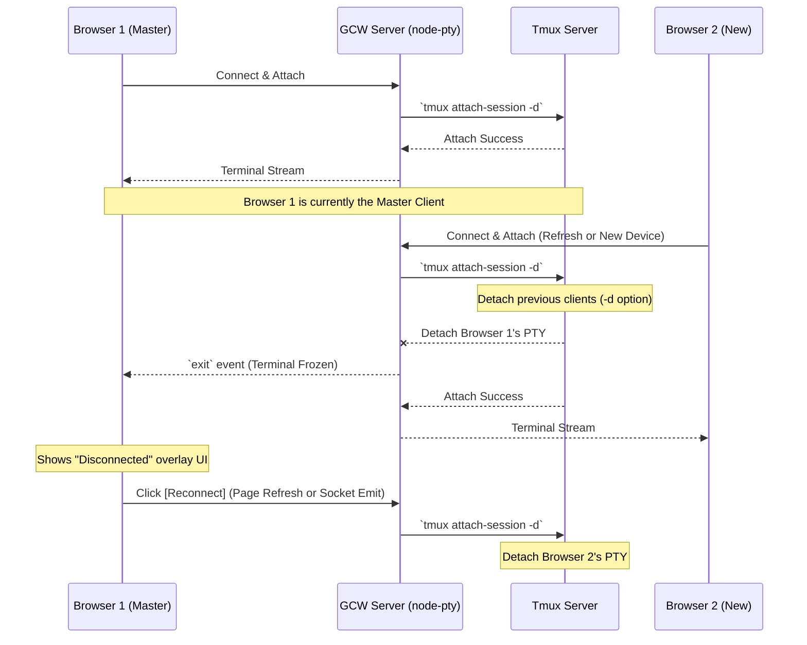

# Tmux & Terminal Control Architecture

이 문서는 Gemini CLI Wrapper(GCW)에서 Tmux 세션을 제어하는 구조와, 각 구성 요소(Tmux, xterm.js, GCW) 간의 역할 분담 및 책임 경계(Responsibility Boundaries)를 설명합니다.

---

## 1. 아키텍처 개요 (High-Level View)

GCW의 터미널 시스템은 세 가지 주요 계층으로 구성됩니다.

1.  **Backend (Tmux + node-pty)**: 실제 프로세스가 실행되는 운영체제 계층.
2.  **Bridge (Websocket + Socket.IO)**: 서버와 클라이언트를 잇는 데이터 통로.
3.  **Frontend (xterm.js + TmuxManager)**: 사용자에게 보여지고 입력을 받는 UI 계층.

---

## 2. 역할 분담 및 책임 경계 (Responsibility Boundaries)

가장 중요한 질문인 "누가 무엇을 담당하는가?"에 대한 경계선은 다음과 같습니다.

### 2.1 Tmux (The Logic & Buffer Engine) - "상태의 주인"
Tmux는 OS 레벨에서 세션의 '실제 상태'를 유지합니다.
- **세션/윈도우/패널 관리**: 실제 프로세스 계층 구조를 생성하고 유지합니다.
- **화면 버퍼 유지**: 클라이언트가 접속 해제되어도 서버에서 프로그램의 출력 결과를 보관합니다.
- **제어 시퀀스 생성**: 쉘이나 응용 프로그램(vim 등)의 출력을 xterm 호환 이스케이프 시퀀스(Escape Sequences)로 변환하여 보냅니다.
- **복사/붙여넣기 버퍼**: Tmux 내부의 자체 클립보드를 관리합니다.

### 2.2 xterm.js (The Renderer & Input Capturer) - "표현의 달인"
xterm.js는 Tmux와 직접 대화하지 않으며, 전달받은 데이터의 '시각화'와 '입력 변환'만 담당합니다.
- **렌더링**: Tmux로부터 온 원시 바이트 스트림(Raw Bytes)을 해석하여 웹 화면에 글자와 색상으로 그립니다.
- **입력 캡처**: 사용자가 키보드를 누르거나 마우스를 클릭할 때, 이를 Tmux가 이해할 수 있는 바이트 시퀀스로 변환합니다. (예: `Up Arrow` 키 -> `\x1b[A`)
- **터미널 에뮬레이션**: ANSI/VT100 표준 규격을 준수하여 터미널처럼 동작하게 만듭니다.

### 2.3 GCW (The Orchestrator & UI Bridge) - "통제와 확장"
GCW 프로그램은 Tmux와 xterm.js 사이를 중계하고, Tmux의 기능을 웹 UI로 확장합니다.
- **데이터 중계 (Pty Bridge)**: `node-pty`를 사용하여 Tmux의 표준 입출력을 웹소켓(Socket.IO) 이벤트(`input`, `output`)로 변환합니다.
- **메타 제어 (CLI Command)**: 사용자가 웹 UI(탭 클릭, 버튼 클릭)를 조작할 때, GCW 백엔드는 `tmux` CLI 명령어를 직접 실행(`exec`)하여 윈도우를 분할하거나 세션 이름을 변경합니다.
- **사용자 경험 확장**: Tmux 자체는 웹 탭 UI를 가지고 있지 않으므로, GCW가 `tmux list-windows` 명령 결과를 읽어와 상단의 '윈도우 탭'으로 시각화합니다.
- **환경 구성**: `.gcw.conf`에서 읽은 환경 변수를 Tmux 세션 생성 시 주입합니다.

---

## 3. 데이터 흐름 (Data Flow) 및 제어 경로

### 3.1 입력 경로 (Input Path)
1.  사용자가 브라우저(xterm.js)에서 키 입력.
2.  xterm.js가 입력을 바이트로 변환하여 GCW `SocketClient`에 전달.
3.  GCW 백엔드(`terminal.handler.js`)가 `ptyProcess.write()` 호출.
4.  `node-pty`가 가상 터미널을 통해 Tmux 세션에 데이터 주입.

### 3.2 출력 경로 (Output Path)
1.  Tmux 세션의 프로그램이 텍스트 출력.
2.  `node-pty`가 이를 감지하여 GCW 백엔드에 `onData` 이벤트 발생.
3.  백엔드가 `socket.emit('output', data)`로 전송.
4.  브라우저의 xterm.js가 데이터를 받아 화면을 갱신(Render).

### 3.3 관리 경로 (Management Path - GCW 전용)
1.  사용자가 웹 UI의 '윈도우 추가' 버튼 클릭.
2.  GCW 백엔드로 전용 이벤트(`tmux_split` 등) 전송.
3.  백엔드가 **직접 쉘에서 `tmux split-window -t ...` 명령어 실행.**
4.  Tmux 상태가 변경되면, xterm.js는 변경된 화면 결과(시퀀스)를 받아 자연스럽게 화면을 갱신함.

---

## 4. 요약: 경계선 정의

| 기능 | 담당 주체 | 방식 |
| :--- | :--- | :--- |
| **글자 렌더링** | xterm.js | VT100 시퀀스 해석 |
| **키보드 입력 캡처** | xterm.js | 바이트 시퀀스 변환 |
| **세션 데이터 보존** | Tmux | 메모리 버퍼 유지 |
| **윈도우/패널 분할** | Tmux (실행) / GCW (명령) | `tmux split-window` |
| **윈도우 탭 UI** | GCW | `tmux list-windows` 파싱 |
| **터미널 크기 조절** | GCW (중계) / Tmux (적용) | `pty.resize()` 및 `SIGWINCH` |
| **환경 변수 주입** | GCW | `pty.spawn(..., { env })` |

결론적으로, **Tmux는 '무엇이 실행되고 있는가'**를 담당하고, **xterm.js는 '어떻게 보이는가'**를 담당하며, **GCW는 '사용자가 어떻게 이 환경을 통제하는가'**를 담당하여 상호 보완적인 구조를 이룹니다.

---

## 5. 자원 관리 및 생명주기 안정성 (Resource Management & Safety)

### 5.1 node-pty 자원 누수 및 이중 접속 (Double Connection) 위험
`node-pty`는 운영체제 수준에서 가상 터미널을 생성하고 Tmux 세션에 Attach됩니다. 이때 백엔드 서버가 종료되거나 소켓 연결이 끊겼음에도 불구하고 기존 PTY 프로세스가 명시적으로 종료(`kill`)되지 않으면 다음과 같은 치명적인 문제가 발생합니다.

- **유령 클라이언트 (Ghost Client)**: 이전 Master 프로세스가 죽더라도 OS에 살아남은 PTY 프로세스가 Tmux 세션에 여전히 '활성 클라이언트'로 남아있는 현상입니다.
- **백프레셔 (Backpressure) 및 화면 멈춤**: Tmux는 연결된 모든 클라이언트에게 데이터를 복제해서 보냅니다. 만약 유령 클라이언트가 데이터를 읽어가지 않아 OS 파이프 버퍼가 가득 차면, Tmux 서버는 전체 세션의 데이터 전송을 일시 중단하거나 엄청나게 지연시킵니다. 이로 인해 새로운 Master가 접속하더라도 **화면이 초기화되지 않거나 입력 반응이 없는 현상**이 발생합니다.
- **화면 크기 고정 (Resize Deadlock)**: Tmux는 접속된 클라이언트 중 가장 작은 크기에 맞춰 화면을 제한합니다. 응답 없는 유령 클라이언트가 작은 크기(예: 80x24)를 점유하고 있다면, 새로운 Master가 아무리 큰 화면으로 접속해도 화면은 영구적으로 잘린 상태로 고정됩니다.

### 5.2 대응 및 복구 전략 (Recovery Strategies)
GCW는 안정적인 터미널 환경을 위해 다음과 같은 제어 전략을 권장/채택합니다.

1.  **소켓 해제 시 즉시 정리**: `terminal.handler.js`에서 `socket.on('disconnect')` 발생 시, 해당 핸들러와 연결된 `ptyProcess`를 즉시 `kill()`하여 Tmux와의 연결을 끊습니다.
2.  **독점 접속 전략 (Exclusive Attachment)**: 새로운 Master가 세션에 붙을 때, `tmux attach-session -d -t [name]` 옵션을 사용하면 기존에 붙어있던 모든 클라이언트(유령 클라이언트 포함)를 강제로 떼어내고(Detach) 현재 접속자만 유일한 주인으로 설정합니다. 이는 백프레셔와 크기 충돌 문제를 원천적으로 해결하는 가장 강력한 방법입니다.

#### 독점 접속 아키텍처 다이어그램 (Exclusive Attachment Flow)

3.  **강제 리셋 (Tmux Reset)**: UI에서 제공하는 `Reset Tmux Client` 기능은 `tmux detach-client -s [name]` 명령을 통해 세션의 모든 클라이언트를 강제 해제합니다. 화면이 꼬이거나 응답이 없을 때 깨끗한 상태로 복구하는 비상 수단으로 활용됩니다.
4.  **백엔드 종료 시 전수 정리**: 서버 프로세스 종료 시그널(`SIGINT`, `SIGTERM`) 발생 시, 현재 관리 중인 모든 PTY 인스턴스를 순회하며 안전하게 종료하여 유령 클라이언트 발생을 방지해야 합니다.

