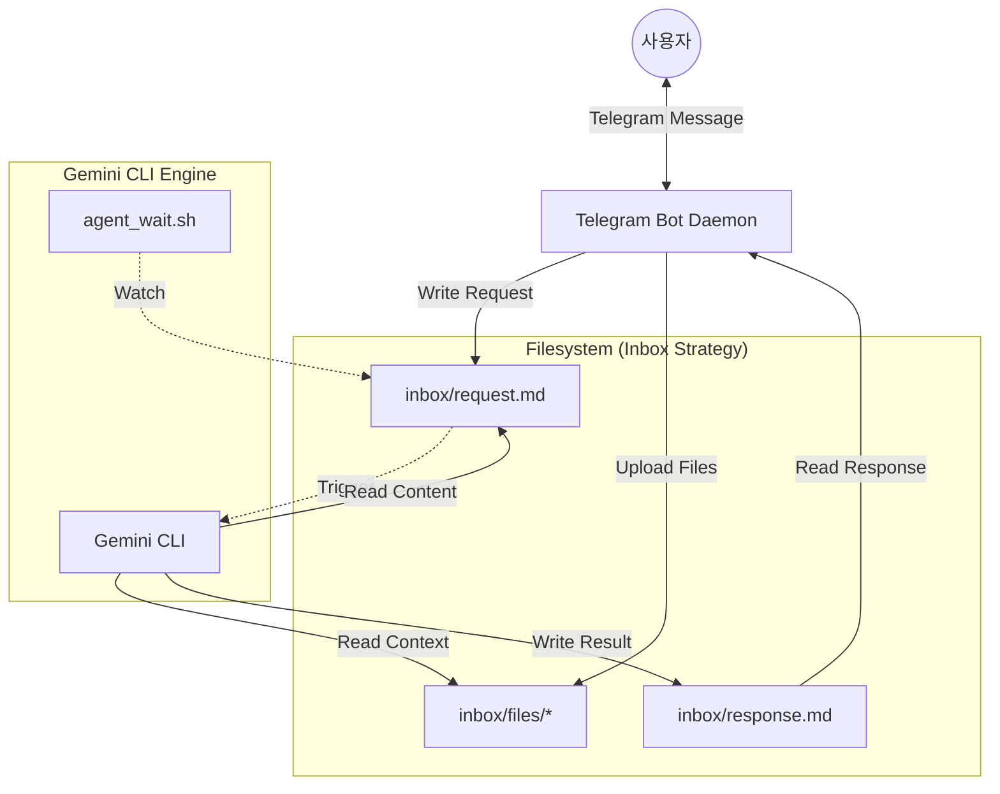
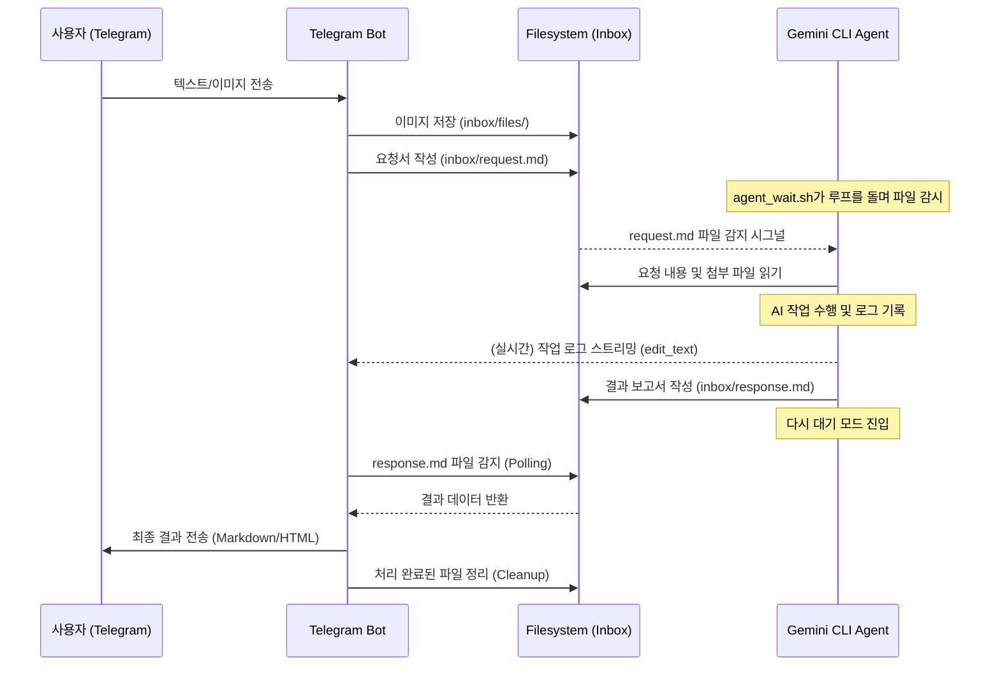

# Telegram GCW Bot: 아키텍처 및 시퀀스 다이어그램 (02)

**날짜:** 2026년 4월 27일 (월)
**문서 번호:** 02
**주제:** 시스템 구조 시각화 및 데이터 흐름 분석

---

## 1. 시스템 아키텍처 (System Architecture)

본 시스템은 사용자의 모바일 접근성을 보장하는 **Telegram Bot** 레이어와 실제 작업을 수행하는 **Gemini CLI** 레이어로 분리되어 있으며, 그 중심에 **파일 시스템 기반의 Inbox**가 위치합니다.

---

## 2. 작업 처리 시퀀스 (Operation Sequence Diagram)

사용자의 요청이 발생했을 때부터 결과가 전달되기까지의 전체 흐름을 설명합니다.

---

## 3. 핵심 아키텍처 포인트 상세 설명

### 3.1. 비동기 시그널링 (Asynchronous Signaling)
*   **파일 존재 여부 = 시그널:** `request.md` 파일이 존재하는 것 자체가 "할 일이 있다"는 신호가 됩니다.
*   **루프 기반 대기:** `agent_wait.sh`는 1초 단위로 파일 시스템을 체크하며, CPU 부하를 최소화하면서도 즉각적인 반응성을 유지합니다.

### 3.2. 실시간 로그 가시성 (Real-time Visibility)
*   프로세스의 표준 출력(stdout)을 별도의 로그 파일로 리다이렉트하고, 봇이 이 로그 파일의 마지막 부분을 지속적으로 읽어 사용자에게 보여줍니다. 이는 긴 작업 시간이 소요되는 AI 서비스에서 사용자 이탈을 방지하는 핵심적인 요소입니다.

### 3.3. 다중 세션 격리
*   각 작업 디렉토리(Workspace)는 독립적인 `inbox` 폴더를 가집니다. 이를 통해 서로 다른 프로젝트 간의 컨텍스트 충돌을 방지하고 보안성을 높였습니다.

---

본 문서는 발표 시 시스템의 안정성과 데이터 흐름의 명확성을 설명하는 시각 자료로 활용됩니다.
